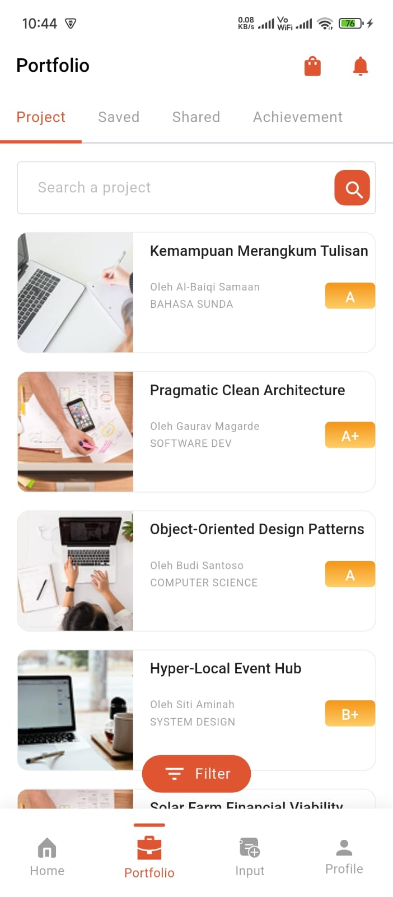

# Yoliday LLP - Flutter Developer Assignment

This repository contains my submission for the Flutter Development assignment at Yoliday LLP. The application is a pixel-perfect, responsive UI implementation based on the provided Figma design.

## 📸 App Screenshot


*(Note: Ensure you have a file named screenshot.png in your main project folder)*

## 🚀 Features Implemented

* **Pixel-Perfect UI:** Closely matches the provided Figma design, including colors, spacing, and layout.
* **Responsive Design:** Built using `flutter_screenutil` to ensure fonts, margins, and component sizes scale perfectly across different device screen sizes.
* **Custom Bottom Navigation Bar:** Features custom SVG icons that change color (orange) with an active indicator line when selected.
* **Functional Search Bar:** Users can type in the search bar to dynamically filter the static portfolio cards based on their title text.
* **Custom Typography:** Uses locally downloaded and bundled fonts (Roboto) as per instructions, completely avoiding `google_fonts` network calls.
* **Clean Architecture & Code:** Code is organized, readable, and uses `ThemeData` for consistent styling.

## 🛠️ Tech Stack & Packages

* **Framework:** Flutter
* **Language:** Dart
* **Responsive Layout:** `flutter_screenutil`
* **Vector Graphics:** `flutter_svg`

## ⚙️ How to Run the Project

1. Clone the repository:
   ```bash
   git clone github.com/Gaurav-Magarde/portfolio_student.git